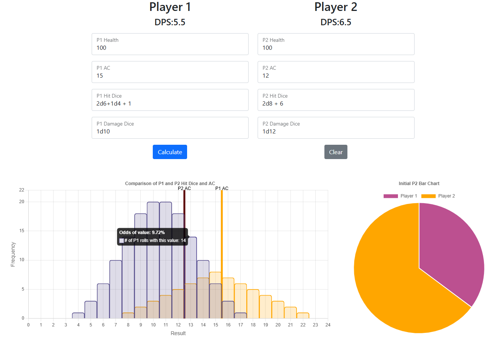
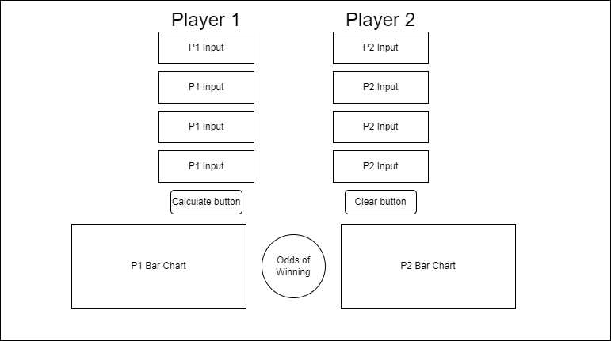

# DND Calculator
This Design Doc will be created using guidelines described in the [Initial Planning document](Initial%20Planning%20Document.md).

## SPRINT 1 WEEK 2 (August 18)
| MON | TUES | WED  | THURS | FRI | SAT |
|--|--|--|--|--|--|
|~~(0.5pts) Sprint planning~~|~~(0.5pts) Vertical line on chart for AC~~|~~(1pt) Display hit dice results in a single chart~~|~~(0.5pts) Migrate code to fboyaka.github.io page~~|~~(0.5pts) Tab visuals~~|(1pt) Home/About Me page|
|~~(0.5pts) Chart update~~|~~(0.5pts) Website layout and page planning~~||~~(0.5pts) Refactor code for fboyaka.github.io~~|~~(0.5pts) Tab functionality~~|(0.5pts) Sprint planning page|

**Table 1:** Scrum Board

## SPRINT 1 WEEK 1 (August 11)
| MON | TUES | WED  | THURS | FRI |
|--|--|--|--|--|
|~~(0.5 pts) Sprint Planning~~|~~(0.5 pts) Button/Input Initialization~~|~~(1 pt) Range of Hit Dice VS AC graph~~|~~(1 pt) DPS Calculation per Character~~|~~(0.5 pts) Sprint Retrospective~~|
|~~(0.5 pts) Initialize Inputs and Buttons~~|~~(0.5 pts) Graph Initialization~~|||~~(0.5 pts) Input Validation~~|

**Table 2:** Completed Scrum Board

## Project Description
Dungeons and Dragons is a popular tabletop game used to simulate combat and roleplaying. In order to practice my data visualization skills, I will create a simple web page that will allow the user to enter information about two individuals in physical combat and display statistical information about the result of the fight.
Page layout is included in the screenshot below:

## Project Workflow
Users will input basic stats for two combatants (Attacker and Defender) which, when the "Calculate" button is pressed, will three sets of informatics will appear: 1) A pie chart depicting the odds that the attacker will win. 2) A bar chart that will display the possible rolls that the attacker and defender and a vertical line depicting the value needed to hit the other opponent (their AC). 3) A table depicting the odds that each combatant is defeated at each turn.

## Story Tasks and Requirements
This project will be divided into three parts:
1.  User Interface (Buttons, input fields, and graph initialization)
	-   8 Text inputs
		-   Attacker/Defender AC
		-   Attacker/Defender HP
		-   Attacker/Defender Hit Dice
		-   Attacker/Defender Damage Dice
	-   2 Buttons
		-   Calculate Result
		-   Clear All Inputs
2.  Functionality (JS functions and input handling)
	-   Clearing Inputs
	-   Data Validation
	-   Processing input for visualization
3.  Data Visualization (Dynamic graphs)
	-   Average DPS per character
	-   Odds of which character would win
	-   Range of Hit Dice vs opposing AC

## Technologies
-    HTML
-    JS
	-   Chart.js
	-   Math.js
	-   Bootstrap 5

## Additional Features
The following are "nice to have" features that are not to be added to this current iteration of the project.
-   Toggle for who goes first.
-   Multiple attacks.
-   Average health per round.
-   Calculating spells.
-   Table that shows how much health each character would have after each round.
-   Enhancement (Bless, Bane, Etc.).

## Sprint Review
| LIKED | LEARNED | LACKED  | LONGED FOR |
|--|--|--|--|
|Timeliness of completing tasks.|Break more complicated tasks (i.e. hit dice table) into visualization and functionality instead of the entire goal.|More specific requirements for deliverables|More time to clean up the visuals.|
|Pivoting the code structure to follow traditional file organization.|Displaying and updating a graph with Chart.js|||

**Table 3:** Sprint Review Board

This was a successful sprint. The original version of this project was predicted to take 3 weeks but after careful consideration I was able to create a functional product in only 5 days (including today).

Overall, the only thing left wanting for this sprint was cleaning up the visuals for the plot and HTML page itself to be more :sparkles:elegant:sparkles:. However, the main objective of this sprint was to be an exercise in planning. Therefore, visual improvement can be performed in the future when more time is available and after the complete functionality is complete.